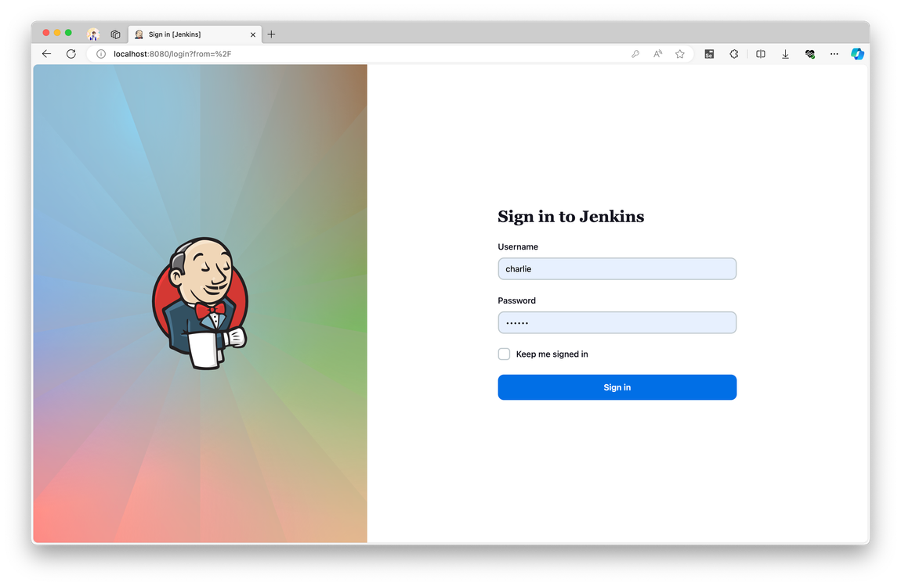
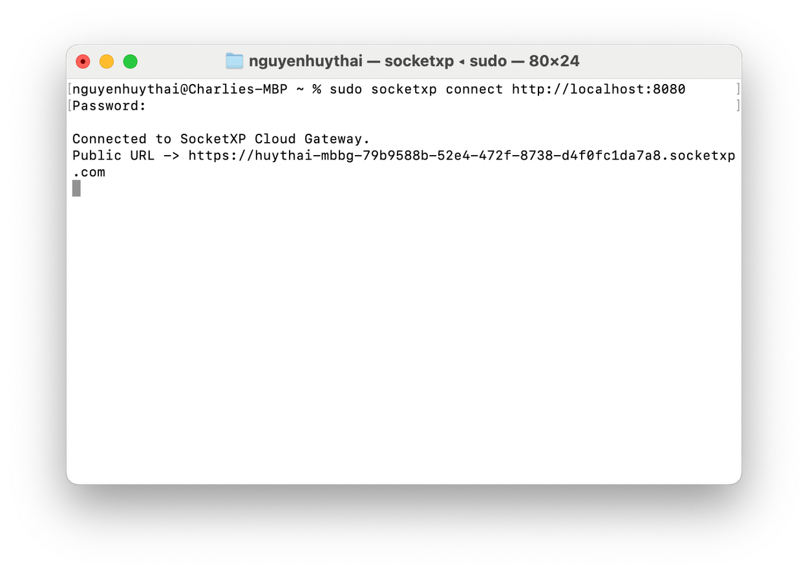
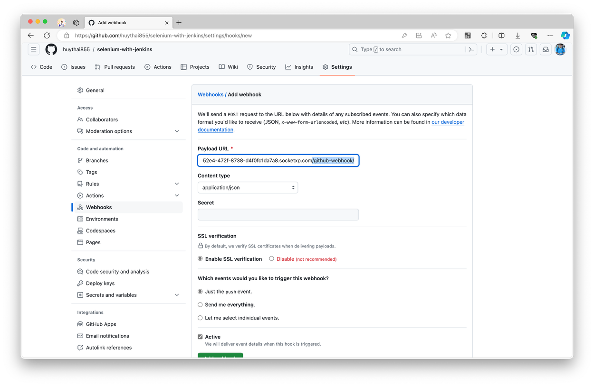
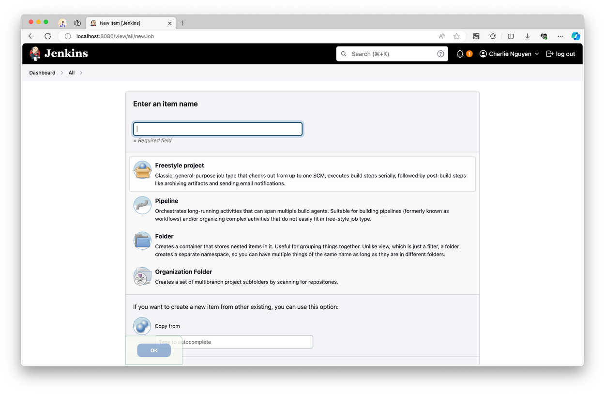
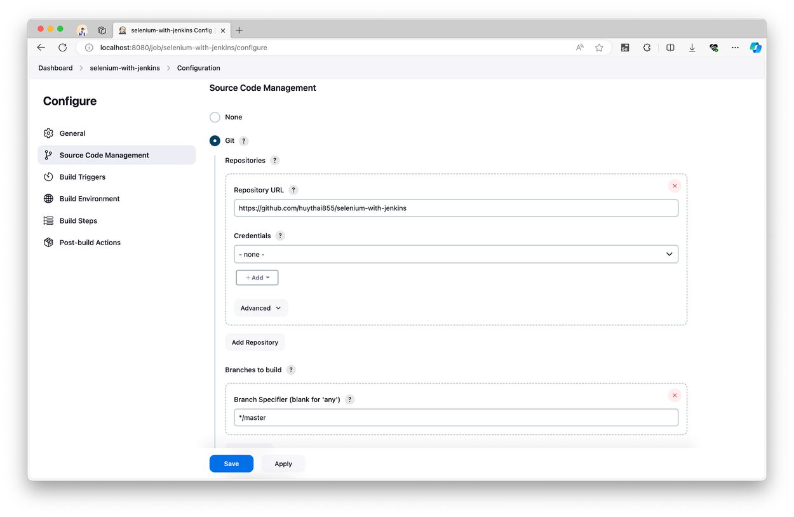
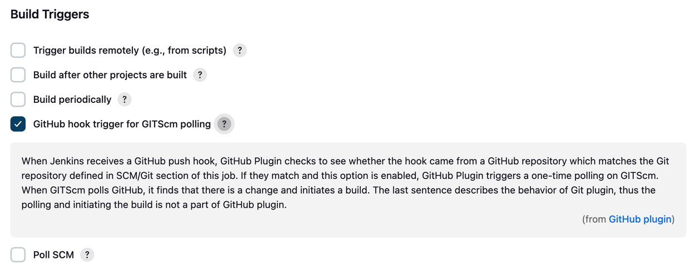
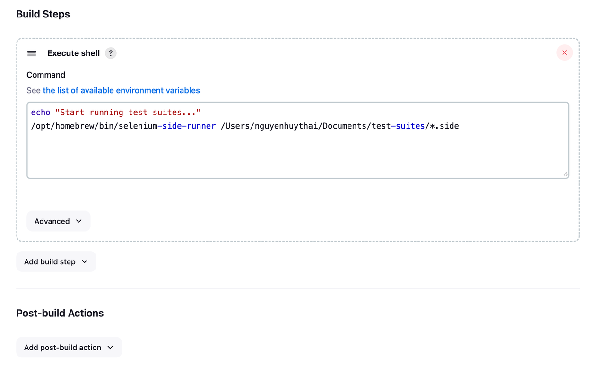
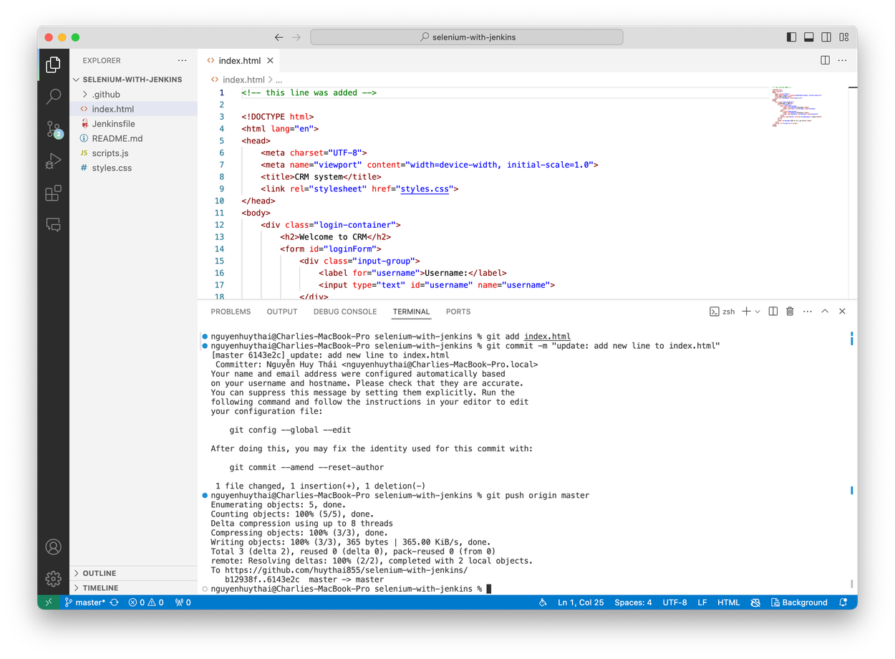
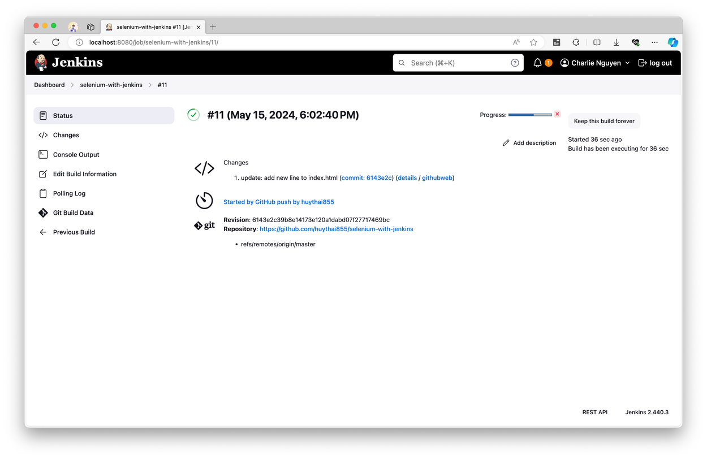
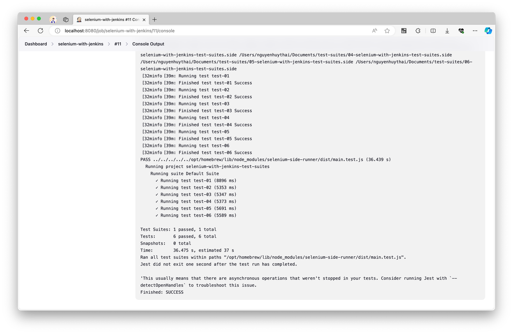

# Selenium with Jenkins
Demo quá trình kiểm thử tự động tích hợp vào CI/CD pipeline sử dụng Selenium và Jenkins

## Tổng quan
CI/CD - Continuous Integration và Continuous Delivery hoặc Continuous Deployment, mô tả công việc tự động hóa trong quá trình phát triển phần mềm và chuyển giao sản phẩm. Khái niệm CI/CD đã trở nên quen thuộc và được sử dụng vô cùng rộng rãi trong lĩnh vực phát triển phần mềm, giúp cho việc tích hợp diễn ra nhanh hơn, tránh downtime và sản phẩm được đưa đến môi trường người dùng trong thời gian sớm nhất.

Trong phần thực nghiệm lần này, nhóm chúng tôi đã tích hợp công cụ kiểm thử Selenium vào một phần trong quá trình CI/CD để triển khai ứng dụng sử dụng nền tảng lưu trữ mã nguồn Github và công cụ tự động hóa Jenkins cho việc kiểm thử tự động một ứng dụng đăng nhập khi có các bản update mới được developer push lên github. Các hành vi của hệ thống và việc xây dựng các bộ test nhóm sẽ không đề cập nhiều ở phần này mà sẽ tập trung hơn vào phần setup hệ thống CI/CD với Jenkins và Selenium.

<br />

## Cài đặt môi trường
Để cài đặt được quy trình tích hợp như mô tả trên, chúng ta cần cài đặt một số thư viện & ứng dụng, bao gồm: [SocketXP](https://www.socketxp.com/), [Jenkins](https://www.jenkins.io/), [Node.js](https://nodejs.org/en) và [Selenium Side Runner](https://www.selenium.dev/selenium-ide/docs/en/introduction/command-line-runner). Dưới đây là hướng dẫn cài đặt cho MacOS (Apple Silicon):
``` bash
# Cài đặt SocketXP
$ curl -O https://portal.socketxp.com/download/darwin/arm64/socketxp
$ chmod +wx socketxp
$ sudo mv socketxp /usr/local/bin

# Cài đặt Jenkins
$ brew install jenkins-lts

# Cài đặt Node.js
$ brew install node

# Cài đặt Selenium Side Runner
$ npm install -g selenium-side-runner
```

<br />

## Cấu hình webhook
Đầu tiên, để khởi động Jenkins, ta sẽ các lệnh. Khi này Jenkins sẽ được khởi động và chạy dưới địa chỉ mặc định là `https://localhost:8080/`, ta có thể đăng kí tài khoản, đăng nhập và sử dụng.
```bash
$ brew services start jenkins-lts
Service ‘jenkins-lts‘ already started, use ‘brew services restart jenkins-lts‘ to restart.
```


Sau khi Jenkins đã khởi động ở port 8080, ta sẽ mở một HTTPS Tunnel tại địa chỉ này sử dụng SocketXP.


Ta sẽ lưu địa chỉ HTTPS Tunnel được tạo bởi SocketXP và cấu hình trong phần WebHook của dự án cần thử nghiệm trên Github, và sẽ thêm `/github-webhook/` vào cuối URL và cấu hình Content type là **application/json** và lưu lại. Xong bước này là ta đã cấu hình được webhook, và giờ mỗi khi có thay đổi mã nguồn trên github (giả sử như có lập trình viên push code lên), webhook sẽ được trigger và Jenkins sẽ nhận được thông báo và thực hiện các tác vụ như ta cấu hình.


<br />

## Cấu hình Jenkins
Ở giao diện trang chủ của Jenkins, ta sẽ tạo dự án mới, chọn _Freestyle project_.


Sau khi dự án được thiết lập, ta sẽ đi cài đặt một số thông số của dự án ở tab Configurations. Ở mục Source Code Management ta sẽ cài địa chỉ dự án trên github và nhánh cần test là **master**.


Ở phần Build Triggers, ta sẽ chọn **GitHub hook trigger for GITScm polling**.


Ở phần build step và post build action ta sẽ cài đặt những công việc mà Jenkins cần làm trong quá trình build và sau khi build. Vì ta đã cài đặt Selenium side runner và đã có bộ test sẵn nên ở đây ta chỉ cần gọi để chạy là được. Ngoài ra ta có thể config thêm các lệnh khác như xuất report, gửi báo cáo tới người dùng, chạy tiếp 1 workflow khác,... tùy theo nhu cầu sử dụng và lưu lại dự án.


<br />

## Thử nghiệm quá trình CI/CD
Giờ ta sẽ thực thiện một số thay đổi trong mã nguồn của dự án và push lại lên github.


Ngay lập tức, Github sẽ gửi message về cho Jenkins thông qua HTTPS Tunnel với webhook ta đã cài đặt. Jenkins nhận được thông báo và lập tức khởi chạy một bản build mới với các thuộc tính và câu lệnh như ta đã cấu hình. Và Selenium Side Runner sẽ được gọi và làm nhiệm vụ của mình.


Ta có thể xem lại Build Console để xem quá trình build và kết quả các test được thực thi, ở đây cả 6/6 test đã được thực thi với trạng thái của tất cả đều là **passed**.


Với thực nghiệm trên, ta đã thực hiện thành công việc kiểm thử với Selenium Side Runner được tích hợp trong quá trình CI/CD với sự hỗ trợ của các công cụ như Github Workflow, Jenkins và Node. Trong thực nghiệm này, nhóm chỉ thực hiện một số tác vụ đơn giản, tuy nhiên trong thực tế ta có thể cấu hình các công cụ thực hiện được rất nhiều tác vụ kiểm thử mạnh mẽ khác.


 
